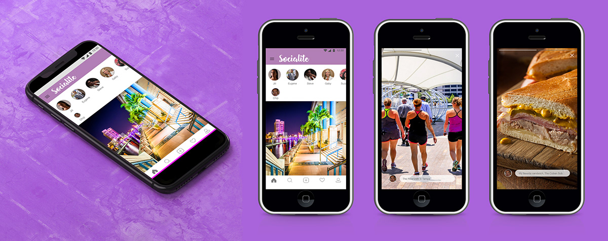
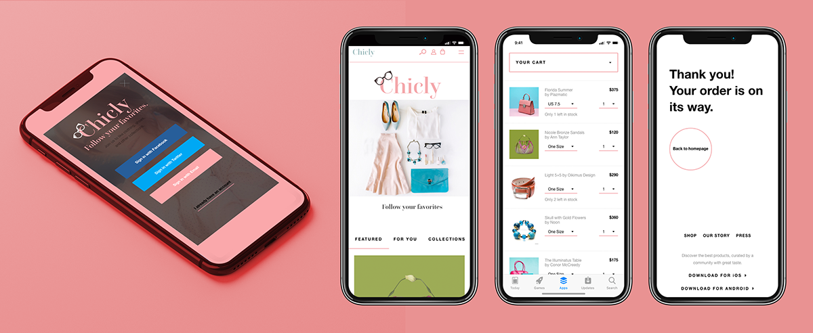
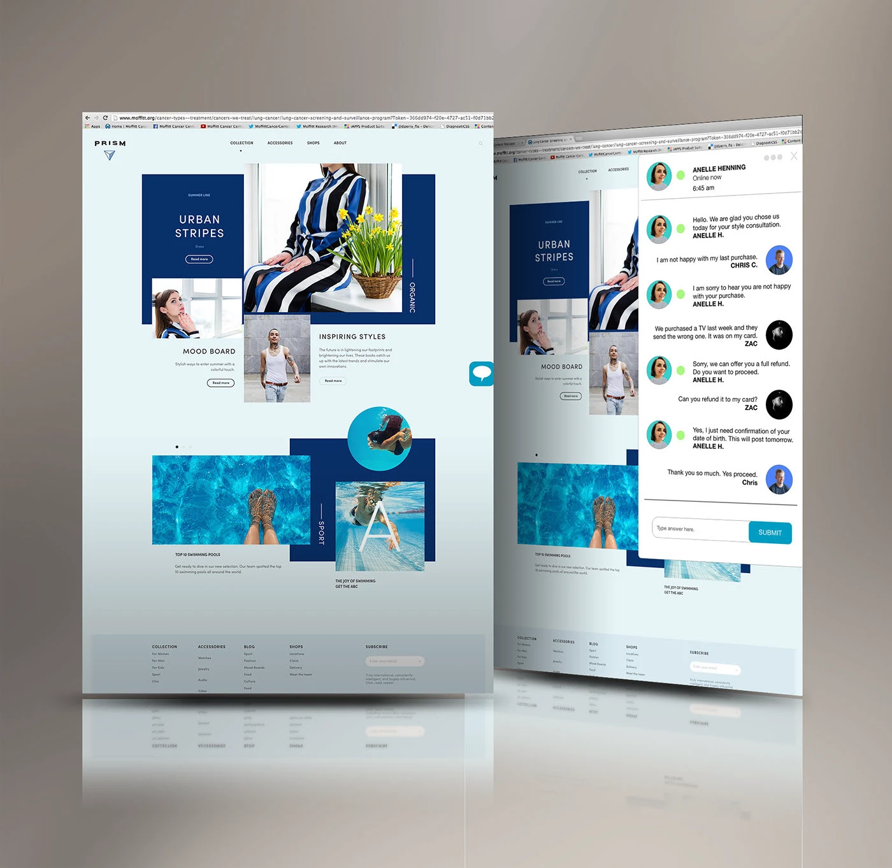
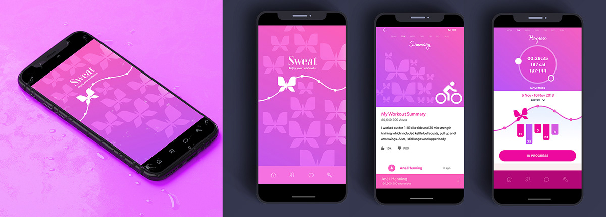
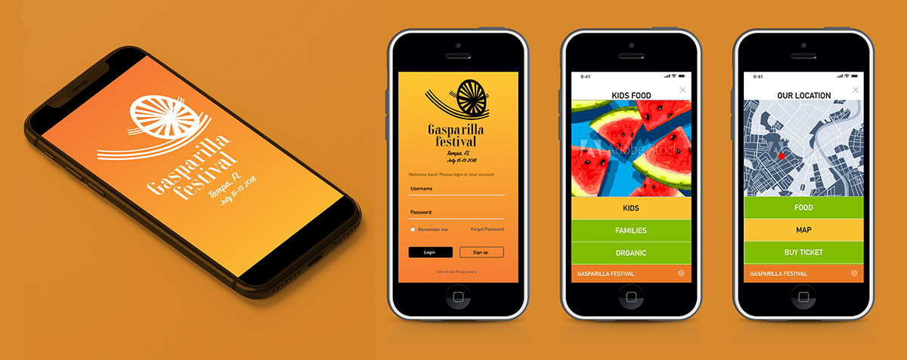
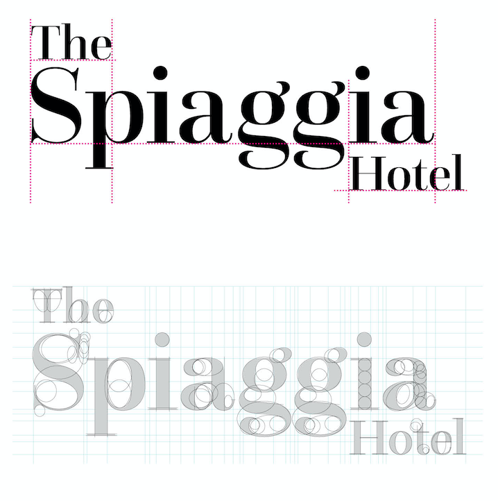
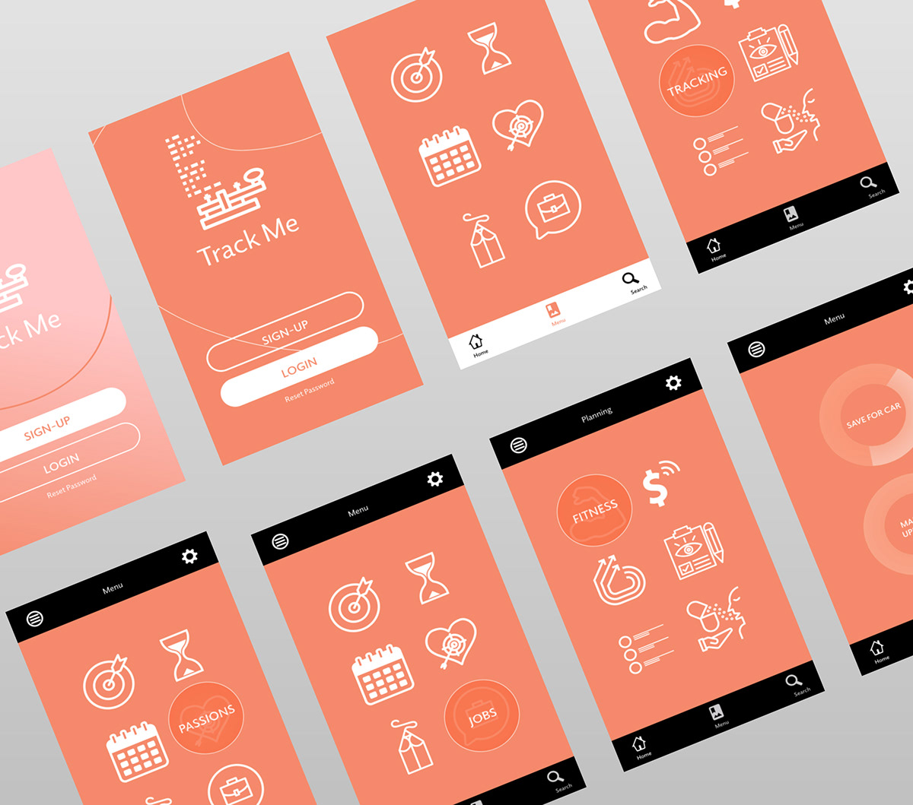
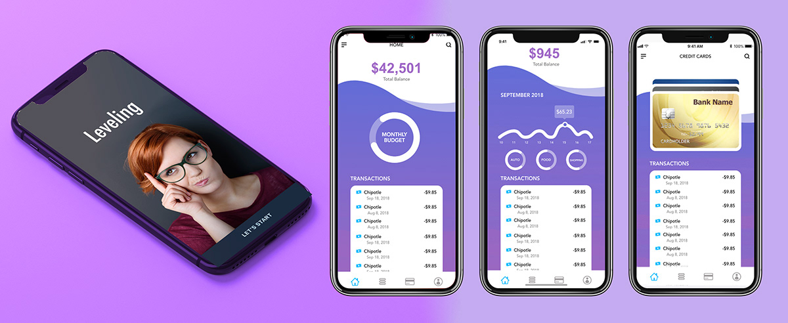

<!-- Banner -->
<p align="center">
  
</p>

<!-- Animated greeting -->
<h1 align="center">
  
</h1>

<p align="center">
  <a href="mailto:anelhenning2@student.purdueglobal.edu">
    
  </a>
  <a href="https://github.com/AnelHenning2-collab">
    
  </a>
  
  
</p>

---

## About Me

I'm a **Cybersecurity Machine Learning Engineer** based in Tampa, Florida — working at the crossroads of AI, security, and blockchain infrastructure. I build systems that detect, classify, and respond to threats using machine learning, and I design decentralized token infrastructure aligned with the latest advances in AI inference computing.

- 🎯 Currently preparing for the **CompTIA Security+** exam (target: June 2026)
- 🧠 Self-teaching **Deep Learning** through structured Cornell note-taking + spaced repetition
- 🔬 Building a portfolio around **Quantum ML**, **threat detection**, and **blockchain token infrastructure**
- ⚡ Aligned with **NVIDIA GTC 2026** themes: token factory efficiency, inference scaling, and deep learning augmentation
- 📚 Studying from: *Hands-On ML with Scikit-Learn, Keras & TensorFlow* · Andrew Ng's Deep Learning Specialization
- 🎓 Enrolled at **Purdue Global** — Cybersecurity focus

> *"The token is the basic unit of modern AI."* — Jensen Huang, NVIDIA GTC 2026

---

## ⭐ Flagship Project — LogikaQBits Token Factory

<table>
<tr>
<td width="60%">

### [LogikaQBits – Solana Token-2022 dApp](https://github.com/AnelHenning2-collab/LogikaQBits-dApp)

A production-grade **token factory** built on Solana using the Token-2022 program — a full-stack dApp that mints, augments, and deploys on-chain tokens through a guided multi-step interface.

**Directly aligned with NVIDIA GTC 2026:**
- Token factory architecture mirrors NVIDIA's Nebius Token Factory (session S82234)
- Scale up / scale out patterns applied to blockchain token deployment
- Deep learning token augmentation — inference throughput mapped to on-chain mint pipeline
- Authority revocation = frozen model weights — immutable, trustless supply

**[View Repo →](https://github.com/AnelHenning2-collab/LogikaQBits-dApp)** &nbsp;|&nbsp; **[Live Demo →](https://anelhenning2-collab.github.io/LogikaQBits-dApp/)**

</td>
<td width="40%" align="center">

<br/><br/>
<br/><br/>
<br/><br/>


</td>
</tr>
</table>

<details>
<summary><b>What makes this a strong portfolio piece — click to expand</b></summary>
<br/>

| Skill | Demonstrated By |
|---|---|
| **Token factory design** | Minting pipeline with throughput and cost optimization |
| **Scale up** | On-chain metadata, Token-2022 extensions, IPFS URI |
| **Scale out** | Multi-wallet ATA deployment, parallel token distribution |
| **Deep learning analogy** | Inference tokens mapped to blockchain tokens (NVIDIA GTC 2026) |
| **Smart contract security** | Ethereum escrow with Checks-Effects-Interactions pattern |
| **Authority revocation** | Immutable supply — analogous to frozen neural network weights |
| **Web3 UX/UI** | Responsive multi-step wizard with wallet integration |
| **Unit testing** | 3 Jest test cases covering mint, metadata, and revocation |
| **Cross-chain** | Both Solana (Token-2022) and Ethereum (Solidity/ERC-20) |

**Why it matters now:** At NVIDIA GTC 2026, Jensen Huang projected $1 trillion in revenue through 2027, driven by the shift from training to large-scale inference. Token throughput is now directly linked to revenue — and understanding token infrastructure at this level is the skill set companies are hiring for.

</details>

---

## 🛒 GlideCart — Autonomous Retail Vehicle Research Proposal

<p align="center">
  <a href="https://anelhenning2-collab.github.io/glidecart-research/" target="_blank">
    
  </a>
  &nbsp;
  <a href="https://github.com/AnelHenning2-collab/glidecart-research" target="_blank">
    
  </a>
</p>

<table>
<tr>
<td width="55%">

### [GlideCart — Autonomous Grocery Delivery Vehicle](https://anelhenning2-collab.github.io/glidecart-research/)

GlideCart is an autonomous shopping and delivery vehicle concept for grocery logistics — conceived during graduate research at Purdue Global (MS Cybersecurity Management, 2026). The project grew into a formal PhD research proposal exploring whether emerging quantum computing tools could solve real routing, security, and navigation challenges in retail environments.

The proposal was shaped by studying published research from quantum computing faculty at **Harvard**, **MIT**, **Yale**, **Stanford**, **University of Chicago**, **University of Maryland**, **IonQ**, **PsiQuantum**, and **Quantinuum** — each institution's focus areas directly informing a different pillar of the GlideCart architecture.

**Research proposal highlights:**
- **Autonomous navigation concept** — ROS-based pathfinding + AI-driven item recognition software stack
- **Post-quantum security research** — exploring lattice-based cryptography and AES hybrid models for retail data protection
- **Delivery scheduling investigation** — researching optimization approaches for grocery routing problems
- **5-phase development roadmap** — Q1 2026 through 2030+, with budget and risk mitigation framework
- **$14.5M research budget model** across 5 risk pillars with reduction targets documented in financial plan

**[View Full Portfolio →](https://anelhenning2-collab.github.io/glidecart-research/)**

</td>
<td width="45%" align="center">

<br/>
<sub>GlideCart navigating grocery store aisles — item recognition active</sub><br/><br/>

<br/>
<br/>
<br/>


</td>
</tr>
</table>

<p align="center">
  
  &nbsp;
  
  &nbsp;
  
</p>

<details>
<summary><b>Research documents produced — click to view</b></summary>
<br/>

| Document | What it covers | Download |
|---|---|---|
| **Executive Summary** | 1-page overview of the GlideCart concept — autonomous grocery navigation, Jan 2026 | [📄 PDF](https://github.com/AnelHenning2-collab/AnelHenning2-collab/raw/main/assets/docs/GlideCart_ExecutiveSummary.pdf) |
| **Financial Risk Plan** | 19-page risk mitigation matrix — 5 pillars, budget breakdowns, and reduction targets | [📄 PDF](https://github.com/AnelHenning2-collab/AnelHenning2-collab/raw/main/assets/docs/GlideCart_FinancialRiskPlan.pdf) |
| **Development Roadmap** | 17-page 5-phase roadmap with institution research alignment and budget per phase | [📄 PDF](https://github.com/AnelHenning2-collab/AnelHenning2-collab/raw/main/assets/docs/GlideCart_Roadmap.pdf) |

</details>

<details>
<summary><b>Institutions whose published research inspired this proposal — click to expand</b></summary>
<br/>

| Institution | Research Focus That Shaped GlideCart |
|---|---|
| **Harvard University** | Quantum complexity theory, optical qubit architectures, post-quantum cryptography |
| **MIT** | Quantum engineering, scalable superconducting systems, hybrid quantum-classical workflows |
| **Yale University** | Circuit QED, modular quantum architectures, superconducting qubit design |
| **Stanford University** | Quantum algorithms, photonic sensing, quantum-safe cryptography applications |
| **University of Chicago** | Quantum spintronics, molecular qubits, quantum sensing for navigation |
| **University of Maryland** | Trapped-ion quantum systems, algorithm complexity, NISQ-era applications |
| **IonQ** | Practical algorithmic performance, NISQ-era deployed quantum computing |
| **PsiQuantum** | Photonic quantum computing, semiconductor-scale fault-tolerant systems |
| **Quantinuum** | Quantum-safe encryption, Quantum Origin integration, applied cryptography |

</details>

### Origin Story — From Deli Clerk to Research Proposal

> I worked as a **Deli Clerk at Publix Supermarkets** in Tampa, FL from **2015–2025** — 10 years observing how grocery logistics, peak-hour congestion, and inefficient routing created real bottlenecks that technology hadn't solved. That lived experience is the foundation of GlideCart. I enrolled in CS at Rasmussen, then MS Cybersecurity at Purdue Global, and channeled everything I was learning — autonomous systems, post-quantum encryption, secure architecture — into a research proposal for the problem I watched every day.

---
## 🔬 GlideCart Research Labs — Quantum Computing PhD Prep

<p align="center">
  <a href="https://anelhenning2-collab.github.io/glidecart-labs/" target="_blank">
    
  </a>
  &nbsp;&nbsp;
  <a href="https://github.com/AnelHenning2-collab/glidecart-labs" target="_blank">
    
  </a>
</p>

Four labs, each tied directly to one research question in my PhD thesis statement. They run on classical hardware today and produce honest baselines. The quantum extensions are the PhD research targets — fully specified, not yet implemented.

| Lab | Research Question (Thesis) | Key Result |
|-----|---------------------------|------------|
| **[Lab 1 — Routing](https://github.com/AnelHenning2-collab/glidecart-labs/tree/master/lab1-routing)** | Can hybrid quantum-classical optimization improve retail routing over classical heuristics? | SA beats NN by **5.0%** — QAOA requires 12 qubits on IonQ Forte |
| **[Lab 2 — Encryption](https://github.com/AnelHenning2-collab/glidecart-labs/tree/master/lab2-encryption)** | What cryptographic architecture protects retail data in a post-quantum threat landscape? | **Kyber-768 + AES-256 hybrid** (NIST FIPS 203) — same latency as RSA, fully quantum-safe |
| **[Lab 3 — Error Correction](https://github.com/AnelHenning2-collab/glidecart-labs/tree/master/lab3-error-correction)** | How can QEC principles enable fault-tolerant fleet communication? | Steane [7,1,3] reduces logical error by **79%** at 1% physical noise |
| **[Lab 4 — Hardware Spec](https://github.com/AnelHenning2-collab/glidecart-labs/tree/master/lab4-hardware-spec)** | What is the minimum viable quantum hardware spec for GlideCart's algorithms? | **IonQ Forte** — all-to-all, 0.07% gate error — only system where all 3 algorithms are viable today |

> **Honest framing:** These labs establish the classical baseline a PhD program would extend. Quantum hardware experiments (QAOA circuits, Qiskit simulation, Steane code on trapped-ion) require PhD lab access at UMD QuICS, Harvard HQI, or U. Chicago CQE — my PhD targets for 2027.


---

## 📚 Logical Learning — Security+ SY0-701 Study Site

<p align="center">
  <a href="https://anelhenning2-collab.github.io/logical-learning/" target="_blank">
    
  </a>
  &nbsp;
  <a href="https://github.com/AnelHenning2-collab/logical-learning" target="_blank">
    
  </a>
</p>

An interactive Security+ SY0-701 study site I built for my own exam prep — 4 modules, each with visual concept explainers and a 12-question scored quiz. All content is grounded in the SY0-701 exam objectives. Progress is saved locally so each session picks up where you left off.

| Module | Domain | Topics | Questions |
|---|---|---|---|
| [**Threats & Attacks**](https://anelhenning2-collab.github.io/logical-learning/threats.html) | Domain 1 (~22%) | Threat actors, malware types, social engineering, attack frameworks, vulnerability categories | 12 |
| [**Cryptography & PKI**](https://anelhenning2-collab.github.io/logical-learning/crypto.html) | Domain 2 (~15%) | Symmetric/asymmetric, hashing, PKI, TLS, digital signatures, certificate management | 12 |
| [**Network Security**](https://anelhenning2-collab.github.io/logical-learning/network.html) | Domain 3 (~24%) | Firewalls, IDS/IPS, VPNs, DMZ, segmentation, wireless security, protocols | 12 |
| [**Identity & Access**](https://anelhenning2-collab.github.io/logical-learning/identity.html) | Domain 4 (~16%) | Auth factors, MFA, SSO/federation, Zero Trust, PAM, access control models, directory services | 12 |

**[Open Logical Learning →](https://anelhenning2-collab.github.io/logical-learning/)**

---
## 🔐 Cybersecurity Portfolio — Purdue Global

<p align="center">
  <a href="https://anelhenning2-collab.github.io/purdue-grad-samples-2026/" target="_blank">
    
  </a>
  &nbsp;
  <a href="https://github.com/AnelHenning2-collab/purdue-grad-samples-2026" target="_blank">
    
  </a>
  &nbsp;
  <a href="https://github.com/AnelHenning2-collab/PurdueGlobal" target="_blank">
    
  </a>
</p>

<table>
<tr>
<td width="55%">

### [MS Cybersecurity Gallery →](https://anelhenning2-collab.github.io/purdue-grad-samples-2026/)

A visual gallery of **29 graduate portfolio pages** from Purdue Global's MS Cybersecurity program — covering applied statistics, risk analysis, blockchain development, platform security, and client design work. Browsable by course with lightbox preview.

**Courses covered:**
- **IN555** Statistics for IT — Red Diamond airline identity, R/Python statistical analysis
- **IT527** Foundation Data Analysis — Power testing, regression, Kaggle datasets
- **IT628** Quantitative Risk Assessment — Threat modeling, risk matrices, MITRE ATT&CK
- **IN532** Blockchain Development — Solana Token-2022, Ethereum escrow, LogikaQBits dApp
- **IT544** Platform Security — Cloud IAM, zero-trust, container hardening, incident response
- **Research Writing in IT** — Graduate-level technical writing and literature review

</td>
<td width="45%" align="center">

<br/><br/>
<br/><br/>
<br/><br/>


</td>
</tr>
</table>

<details>
<summary><b>Graduate coursework highlights — click to expand</b></summary>
<br/>

| Course | Key Work | Tools |
|---|---|---|
| **IN532 Blockchain Dev** | LogikaQBits Token-2022 dApp, Ethereum escrow, smart contract security | Solana, Solidity, JS |
| **IT544 Platform Security** | Zero-trust architecture, cloud IAM hardening, container security, incident response | Linux, Docker, IAM |
| **IT628 Quantitative Risk** | Threat probability matrices, MITRE ATT&CK mapping, quantitative risk scoring | Python, Excel |
| **IN555 Statistics for IT** | Inferential statistics for cybersecurity data, regression on threat datasets | R, Python, SPSS |
| **IT527 Data Analysis** | Power testing, multivariate analysis, Kaggle security datasets | Python, Pandas |
| **Research Writing in IT** | Graduate technical literature review and applied research methodology | APA 7th Ed. |

**Why it matters:** Purdue Global's MS Cybersecurity curriculum bridges quantitative analysis with hands-on security engineering — the same skill set powering AI-driven SOC automation and threat inference pipelines aligned with NVIDIA GTC 2026 themes.

</details>

---

## 🖥️ Computer Science Portfolio — Rasmussen University

<p align="center">
  <a href="https://anelhenning2-collab.github.io/rasmussen-cs-portfolio/" target="_blank">
    
  </a>
  &nbsp;
  <a href="https://github.com/AnelHenning2-collab/rasmussen-cs-portfolio" target="_blank">
    
  </a>
</p>

<table>
<tr>
<td width="55%">

### [Computer Science BS Gallery →](https://anelhenning2-collab.github.io/rasmussen-cs-portfolio/)

A visual gallery of **58 portfolio pages** from Rasmussen University's Computer Science BS program — browsable by course with lightbox preview.

**Courses covered:**
- Inferential Statistics — USGS, NCLEX hospital analysis
- Software Engineering — UML, Gantt, ACME systems
- Advanced Java — Logika Labs, Track.ly, Eclipse apps
- Database — MySQL, CRUD, ER diagrams, Kaggle
- Discrete Mathematics — Truth tables, Active Attack©
- Web Analytics — Google Analytics, Web 2.0 Conference
- QA, Networks, OS Architecture, Emerging Technology

</td>
<td width="45%" align="center">

<br/><br/>
<br/><br/>
<br/><br/>


</td>
</tr>
</table>

## Tech Stack

### Blockchain & Web3
<p>
  
  
  
  
  
</p>

### Security & Networking
<p>
  
  
  
  
  
</p>

### Machine Learning & AI
<p>
  
  
  
  
  
  
  
</p>

### Quantum Computing
<p>
  
  
  
</p>

### Tools & Platforms
<p>
  
  
  
  
  
</p>

---

## All Projects

| Project | Description | Stack | Status |
|---|---|---|---|
| [**⭐ LogikaQBits-dApp**](https://github.com/AnelHenning2-collab/LogikaQBits-dApp) | Token factory dApp — Solana Token-2022, on-chain metadata, authority revocation, Ethereum escrow. NVIDIA GTC 2026 aligned. | Solana, Solidity, JS | 🟢 Live |
| [**⭐ purdue-grad-samples-2026**](https://anelhenning2-collab.github.io/purdue-grad-samples-2026/) | MS Cybersecurity graduate portfolio — 29 pages, 6+ courses covering threat analysis, blockchain dev, risk assessment, and platform security | Python, R, Security | 🟢 Live Gallery ↗ |
| [**⭐ rasmussen-cs-portfolio**](https://anelhenning2-collab.github.io/rasmussen-cs-portfolio/) | Computer Science BS portfolio — 58 pages, 15+ courses covering Java, databases, software engineering, networks, and QA | Java, MySQL, Python | 🟢 Live Gallery ↗ |
| [**portfolio-samples**](https://github.com/AnelHenning2-collab/portfolio-samples) | Interactive portfolio showcase with project index | Markdown | 🟢 Public |
| **quantumchoice-qdof** | Quantum-assisted retail decision optimization using QAOA (6-qubit, ~20% runtime reduction) | Qiskit, Python | 🔧 Building |
| **ml-phishing-url-detector** | ML classifier that detects phishing URLs — bridging security and AI | Python, Scikit-Learn | 🔧 Building |
| **cyber-soc-detection-lab** | SOC detection lab with log analysis, MITRE ATT&CK mapping | Python, Linux | 🔧 Building |
| **qfla-quantum-financial-ledger** | Quantum financial ledger anomaly detection | Qiskit, Python | 🔧 Building |

---

## Certifications & Learning Path

```
✅ Purdue Global — Cybersecurity + Blockchain coursework (2026)
✅ LogikaQBits dApp — Solana Token-2022 production deployment
🎯 CompTIA Security+ — Exam target: June 2026
📖 Andrew Ng Deep Learning Specialization — In progress
📖 Hands-On ML (Scikit-Learn, Keras, TensorFlow) — In progress
🔬 Quantum Computing with Qiskit — Active research
```

---

## GitHub Stats

<p align="center">
  
  
</p>

<p align="center">
  
</p>

---

## How I Study

I use a **video-based Cornell note-taking system** — I record myself teaching every concept I learn, then review using spaced repetition. This approach forces deep understanding before anything goes in a repo.

```
📹 Record  →  📝 Cornell Notes  →  🔁 Spaced Repetition  →  💻 Build a project
```

---

## Activity

<p align="center">
  
</p>


---


---

## 🎨 UI/UX Design Portfolio — Adobe XD · Behance

<p align="center">
  <a href="https://www.behance.net/anellehenning" target="_blank">
    
  </a>
  &nbsp;
  
  &nbsp;
  
  &nbsp;
  
  &nbsp;
  
</p>

> **Foundation:** BFA in Graphic Design — Maryland Institute College of Art (MICA), Baltimore, MD · 2003
>
> 20+ years of design thinking underpins every system I build. The projects below are Adobe XD daily challenges and personal UX projects from 2018–2019. **Adobe XD** was used for all layout design, wireframing, user flows, and interactive prototyping. **Adobe Photoshop** was used for device mockups, compositing, and presentation imagery. All prototypes were built for **iPhone (notch-era, iPhone X form factor)**, **Apple Watch (Series 3)**, and **desktop (MacBook Pro / iMac)** as specified per challenge.

---

### [Adobe XD Daily Challenges: August 2018 ↗](https://www.behance.net/gallery/69340895/Adobe-XD-Daily-Challenges-August-2018)



**Tools:** Adobe XD (layout, prototype, user flow) · Photoshop (mockups) &nbsp;|&nbsp; **Devices:** iPhone (notch form factor) · Desktop browser &nbsp;|&nbsp; **Published:** August 22, 2018

9-day Adobe XD Daily Challenge series. Each day addressed a distinct interaction design problem — from social networking to e-commerce to weather app redesign:

- **Day 1 — Stories:** Designed and prototyped a *Stories* feature for a social networking mobile app called **Socialite** — added color, stock imagery, logo, and user flow transitions
- **Day 2 — Get Feedback:** Prototyped a customer satisfaction survey pop-up for the **PRISM** fashion website — overlay interaction design for web
- **Day 3 — Add to Cart:** Prototyped a sleek *Add to Cart* overlay experience — product page wireframe with cart overlay on item selection
- **Day 4 — Weather Redesign:** Redesigned the **Dark Sky** weather app across 3 screens: Now, Today & Weekly Forecast
- **Day 5 — Messaging App:** Designed a messaging prototype inspired by **Facebook Messenger** — contact list + conversation prototype
- **Day 6 — Restaurant Reservation:** Designed a booking experience inspired by **OpenTable** — map-locate, select, and book
- **Day 7 — Rent a Movie:** Prototyped a desktop movie rental experience inspired by **iTunes** — catalog browse, favorites, single movie card
- **Day 8 — Search Redesign:** Redesigned the **Behance mobile app** search experience — autocomplete feature + optimized results display (2 versions)
- **Day 9 — Freelancer Portfolio:** Designed a web portfolio experience with portrait, skills, job experience, and embedded XD challenge projects

---

### [Chicly — XD Daily Challenge: Fashion Blog & App ↗](https://www.behance.net/gallery/69878835/XD-Daily-Challenge-Fashion-blog-and-app)



**Tools:** Adobe XD (layout, screens, prototype) · Photoshop (iPhone X & MacBook Pro mockups) &nbsp;|&nbsp; **Devices:** iPhone X · MacBook Pro &nbsp;|&nbsp; **Published:** 2018

**Challenge brief:** *"Design a fashion blog with several user experience screens for a trendy women's fashion app."*

**Chicly** — *"Follow your favorites."* A women's fashion discovery app that helps users follow and keep track of their favorite trends. Designed full end-to-end user flow across 6 screens:

- **Splash/Login:** Sign in with Facebook, Twitter, or Email — *"Chicly. Follow your favorites."*
- **Home Feed:** FEATURED · FOR YOU · COLLECTIONS navigation tabs with curated lifestyle editorial
- **Shopping Cart:** Florida Summer by Marinatic · Nona Bronze Sandals by Ann Taylor · Light 5.5 by Olympus Design · Skull with Gold Flowers by Noon · The Aluminium Table by Conor McConely
- **Checkout Confirmation:** *"Thank you! Your order is on its way."*
- **Brand Landing Page:** *"Discover the best products, curated by a community with great taste."* — iOS & Android download CTAs
- **Category Browse:** LIFESTYLE · HOME · WEARABLES — *"Join us to like products, follow friends, and create collections."*

---

### [UX Daily Challenge: July 2018 ↗](https://www.behance.net/gallery/68541953/UX-Daily-Challenge-July-2018)



**Tools:** Adobe XD (layout, prototype) · Kyle's Brushes &nbsp;|&nbsp; **Devices:** Apple Watch (smartwatch) · iPhone (mobile) · Desktop browser &nbsp;|&nbsp; **Published:** 2018

9-day UX Daily Challenge spanning mobile, web, and smartwatch platforms. Apps designed: **PayPath**, **Thalia**, **Travely**, **Blossom**, **Listly**, **Urban Stripes**, **PRISM**:

- **Day 1:** Survey mobile app — multiple choice question, confirm answers, show other participants' results
- **Day 2:** Crowdfunding web page — prototype the *Make a Donation* flow
- **Day 3, 4 & 7 — Travely:** Smart watch flight check-in — display flight info, confirm options, show QR boarding code. Integrated **FaceTime** option + **Lyft** scheduling for baggage claim pickup
- **Day 4:** Electric scooter/shared vehicle rental mobile app — locate vehicle on map, book, complete transaction
- **Day 5 — Blossom:** Flower ordering mobile app — filter by delivery date, scroll options
- **Day 6 — PayPath:** Mobile peer-to-peer cash sending app — send via QR code or contact list shortcut
- **Day 8 — Listly:** To-do list mobile app — task management, due dates, progress tracking
- **Day 9 — PRISM / Urban Stripes:** Chatbot web experience for fictitious client **PRISM** fashion website customer assistance

---

### [Adobe XD Daily Challenge: May 2018 ↗](https://www.behance.net/gallery/65921457/Adobe-XD-Daily-Challenge-May-2018)



**Tools:** Adobe XD CC · Adobe InDesign CC · Adobe Illustrator/Draw CC · Photoshop/Sketch CC · Adobe Lightroom Mobile &nbsp;|&nbsp; **Devices:** iPhone · Apple Watch · Mac & PC &nbsp;|&nbsp; **Font:** DIN Condensed Bold 27pt · Apple Watch status bar 10:09 · iPhone status bar 9:41 &nbsp;|&nbsp; **Published:** 2018

5-assignment challenge series covering activity tracking, weather, fintech, music, and portfolio design:

- **Assignment 1 — Sweat (Activity Tracker):** Designed for women — all assets shown across iPhone and Apple Watch mockups; splash, onboarding, dashboard, and stat screens
- **Assignment 2 — Weather App:** Full-bleed color splash screen for smartphone weather application
- **Assignment 3 — Flixbooks (Movie Tickets):** Designed the movie ticket purchase user flow — how the user thinks through content selection, seat choice, and confirmation
- **Assignment 4 — VOLUMN.LY (Music App):** Built from name and logotype through full screens — launch, splash, library, and search with keyboard
- **Assignment 5 — CURATE.LY (Freelance Portfolio):** UI/UX designer personal portfolio — About Me, Contact Me, and Portfolio sections for FulCircle Creative Solutions

---

### [Adobe XD Daily Challenge: June 2018 — Gasparilla Festival App ↗](https://www.behance.net/gallery/67026831/Adobe-XD-Daily-Challenge-June-2018)



**Tools:** Adobe XD · Adobe Illustrator · Photoshop · Adobe InDesign &nbsp;|&nbsp; **Devices:** iPhone · Apple Watch &nbsp;|&nbsp; **Design Style:** Bauhaus · **Published:** 2018

**Challenge brief:** *"Design a logo for the Gasparilla festival in Tampa, FL. Showcase a mood board with 3 versions of the app for iPhone and smartwatch users."*

Designed the full brand identity and dual-platform app for **Gasparilla** — Tampa's iconic pirate festival. Delivered:
- Custom festival logo (Bauhaus-influenced design grid, Illustrator)
- Mood board establishing visual language and color palette
- 3-version app across **iPhone and Apple Watch** form factors
- Features: *Plan your day* — Food · Map · Tickets — with category filters for Kids, Families, and Organic
- Interactive prototypes for both iPhone and smartwatch user experiences
- Photoshop used for all device mockup presentations

---

### [Adobe Daily Challenge: 3 Luxury Brandscapes ↗](https://www.behance.net/gallery/68642179/Adobe-Daily-Challenge-Design-3-luxury-brandscapes)



**Tools:** Adobe Photoshop · Illustrator · InDesign · Adobe Sketch &nbsp;|&nbsp; **Font:** KOMU A 45pt · Questa Grande Medium 61pt &nbsp;|&nbsp; **Design Inspiration:** David Carson &nbsp;|&nbsp; **Published:** August 2, 2018

**Challenge brief:** *"Design a logo, build a brandscape, and develop mock-ups for 3 fictional brands."* Used design grids for logos and text layouts; David Carson referenced for photo direction.

Three complete brand identities built from concept to mock-up:

1. **Red Diamond** — Fictional first-class airline under British Airways, UK-based. Identity built around the rarity and prestige of red diamonds. Full logo, brandscape, and airline collateral mockups
2. **Shooting Stars Post** — Existing Tampa, FL film production company. Full-service creative agency: video production, post-production, motion graphics, and audio. Logo design, business card mockups, shopping bag, packaging, and cap merchandise
3. **The Spiaggia Hotel** *(Spanish: "beach")* — Fictional adventurous boutique hotel on Venus Beach, FL. Outdoor amenities: surfing, sailing, hiking. Luxury lifestyle branding, logo, and full property mockup suite

---

### [Personal Projects: Project Management & Mentor Apps ↗](https://www.behance.net/gallery/69355273/Personal-projects-project-management-and-mentor-apps)



**Tools:** Adobe XD (layout, prototype, user flow) · Photoshop (device mockups) &nbsp;|&nbsp; **Devices:** iPhone X (notch form factor) &nbsp;|&nbsp; **Font:** Elido Regular 21pt &nbsp;|&nbsp; **Published:** August 22, 2018

4 personal-project fictional app prototypes, each built from scratch with full screen sets and interactive user flows:

- **Fictional App 1 — Track Me (Project Management):** Splash screen + goal tracking — screens: splash, login, menu, goals, time planner, passion, journal, and presents/rewards
- **Fictional App 2 — Mentor App:** Search and list of people, splash screens after on-boarding — connecting mentors and mentees with browse and match flows
- **Fictional App 3 — Email App:** Draft, schedule, and sent splash screens after on-boarding — full email client UX designed from the ground up
- **Fictional App 4 — E-Commerce Shopping App:** Complete shopping experience prototype — browse, product detail, cart, and checkout

---

### [Adobe XD Daily Challenges: September 2018 ↗](https://www.behance.net/gallery/70382205/Adobe-XD-Daily-Challenges-September)



**Tools:** Adobe XD (layout, prototype) · Photoshop (mockups) &nbsp;|&nbsp; **Devices:** iPhone (mobile) · Desktop/iMac (music player, time tracker, agency website) &nbsp;|&nbsp; **Published:** 2018

9-day series spanning mobile apps, desktop software, and web components. Brands featured: **ARMYGEAR**, **Army Star**, **Scorpion (Drake album)**:

- **XD01 — Personal Finance App (Mobile):** Design & prototype a personal finance app using Adobe XD template — color, content, and transition flows. Solution inspired by **Howard Pinsky's** live stream
- **XD02 — Local Landing Page (Web):** Designed a landing page for **Tampa, FL** — city imagery, stock photography, local information
- **XD03 — Newsletter Pop-Up (Web):** Designed and prototyped a newsletter subscription overlay experience for a website
- **XD04 — Music Player Desktop App:** Full desktop music player — album content for **Scorpion (Drake)**, color system, prototype transitions
- **XD05 — Appointment Booking App (Mobile):** Booking flow — select service, date/time, confirm appointment
- **XD06 — Time Tracker Desktop App:** Designed a desktop time tracking tool with color system and content
- **XD07 — Agency Team Page (Web):** Team page for **ARMYGEAR** / **Army Star** — team photos, pop-up profile detail prototype
- **XD08 — Fitness Tracker Mobile App:** Fitness stats, workout tracking, mobile UI with full prototype transitions
- **XD09 — Trivia Mobile App:** Designed a trivia game for mobile — color, questions, full user flow prototype

---

<details>
<summary><b>Full design skills & toolchain — click to expand</b></summary>
<br/>

| Discipline | Tools & Methods |
|---|---|
| **UX Layout Design** | Adobe XD — all wireframes, hi-fi screens, component libraries, linked symbols |
| **Device Mockups** | Adobe Photoshop — iPhone X, Apple Watch Series 3, MacBook Pro, iMac, desktop browser |
| **Brand Identity** | Adobe Illustrator — logo design, vector systems, brandscapes |
| **Print & Layout** | Adobe InDesign — typographic layouts, print collateral, editorial |
| **Photo Compositing** | Photoshop — blending modes, double exposure, puppet warp, channel masking |
| **Prototyping** | Adobe XD — interactive flows, transitions, overlays, development handoff |
| **Animation** | Photoshop CC — GIF animation from illustrations |
| **Design Systems** | Color palettes, typography hierarchies, linked symbols, repeat grids |
| **Platforms Designed For** | iPhone (X/notch form factor) · Apple Watch Series 3 · MacBook Pro · iMac · Desktop browser |
| **Foundation** | BFA Graphic Design — Maryland Institute College of Art (MICA), Baltimore, MD · 2003 |

</details>

---

<p align="center">
  
</p>

<p align="center">
  <sub>Built with <a href="https://www.perplexity.ai/computer">Perplexity Computer</a> · Tampa, FL · 2026</sub>
</p>
